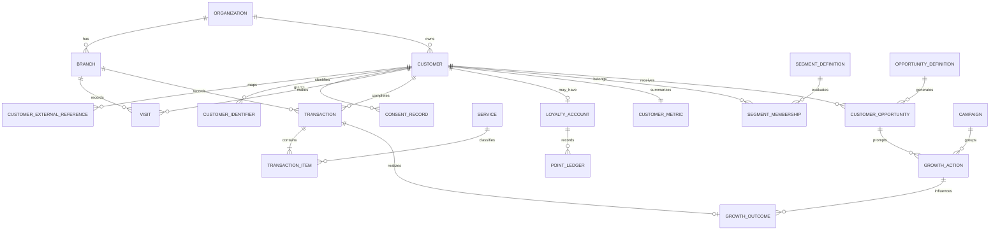

# Custara V1 - Data and Growth Contract

Status: Draft for product review  
Version: 0.1  
Scope: CSV import, core database model, duplicate protection, and universal opportunity engine

## 1. Decisions locked by this document

1. Custara serves recurring-service businesses through a generic core and optional industry presets.
2. `Organization` is the product/domain term. "Tenant" describes the security boundary, not a separate business entity.
3. A customer belongs to an organization, not to one branch. Visits, transactions, actions, and outcomes record their branch.
4. CSV is the first production data source. POS integrations must map into the same canonical contracts.
5. Customer phone numbers are duplicate signals, not unconditional unique keys.
6. NFC and QR identifiers contain opaque, revocable tokens. They are lookup tools, not authentication credentials.
7. Transactions and point events are never silently overwritten.
8. Opportunities are stored per customer. Dashboard opportunity cards are calculated aggregates.
9. Campaign is optional. `GrowthAction` is the first-class record for WhatsApp, calls, reminders, offers, and campaign touches.
10. Loyalty is optional. Near Tier is disabled when no loyalty program is active.

## 2. Canonical CSV import contract

### 2.1 File rules

- Encoding: UTF-8. UTF-8 BOM may be accepted and removed.
- Delimiter: comma.
- Header names: lowercase `snake_case`.
- Empty optional values: empty field, not `NULL`, `N/A`, or `-`.
- Date: `YYYY-MM-DD`.
- Timestamp: ISO 8601 with timezone, for example `2026-08-09T14:03:00+07:00`.
- Money: plain decimal without currency symbols or thousands separators, for example `1850000.00`.
- Currency: ISO 4217 code, defaulting to the organization's currency when empty.
- Boolean: `true` or `false` only.
- Phone: local or international input is accepted, then normalized using the organization's default country.
- Source identifiers are trimmed but retain case for display. Uniqueness uses a normalized form.
- Formulas and executable spreadsheet content must never be evaluated.

### 2.2 Import sequence

1. `customers.csv`
2. `transactions.csv`
3. `transaction_items.csv`
4. `visits.csv` when explicit visit/check-in data exists

Cross-sell requires transaction items and service categories. Transactions without items can still power spend, recency, and frequency metrics.

### 2.3 customers.csv

Required condition: `source_system`, `full_name`, and at least one of `external_customer_id` or `phone`.

| Column | Required | Type | Rule |
|---|---:|---|---|
| source_system | yes | string | Stable source code, for example `LEGACY_CSV` |
| external_customer_id | conditional | string | Preferred stable ID from the source |
| full_name | yes | string | 2-150 characters after trimming |
| phone | conditional | string | Normalized to E.164 when possible |
| email | no | string | Trimmed and lowercased for matching |
| birth_date | no | date | Used only when legitimately required |
| joined_at | no | timestamp | Original membership/customer creation time |
| home_branch_code | no | string | Must resolve inside the organization |
| whatsapp_consent | no | boolean | Empty means unknown, not false |
| consent_recorded_at | conditional | timestamp | Required when consent is true or false |
| membership_number | no | string | External/display identifier, not the NFC secret token |

Customer import behavior:

- Exact external reference maps to the existing customer.
- Without an external ID, exact normalized phone plus exact normalized name may auto-match only when there is one candidate.
- Ambiguous matches go to duplicate review and are not silently merged.
- Import updates permitted profile fields but never deletes visits, transactions, consent history, or points.

### 2.4 transactions.csv

Required condition: every row must include `external_transaction_id` and identify a customer using `external_customer_id` or `customer_phone`.

| Column | Required | Type | Rule |
|---|---:|---|---|
| source_system | yes | string | Data source code |
| external_transaction_id | yes | string | Idempotency key inside the source |
| external_customer_id | conditional | string | Resolved through CustomerExternalReference |
| customer_phone | conditional | string | Fallback customer matcher |
| branch_code | yes | string | Must belong to the organization |
| transaction_type | yes | enum | `sale` or `refund` |
| occurred_at | yes | timestamp | Business event time |
| currency | no | string | Defaults from organization |
| gross_amount | yes | decimal | Positive value |
| discount_amount | yes | decimal | Zero or positive |
| net_amount | yes | decimal | Must equal gross minus discount for a sale |
| refund_of_external_transaction_id | conditional | string | Required for a refund |

Transaction import behavior:

- `(organization_id, source_system, external_transaction_id)` is unique.
- Re-import with the same key and same payload hash is skipped safely.
- Re-import with the same key and different material data is a conflict and requires review.
- Refunds are separate immutable transactions linked to the original transaction.
- Amounts remain positive in the import; `transaction_type=refund` determines their financial effect.
- A transaction never awards loyalty points twice.

### 2.5 transaction_items.csv

| Column | Required | Type | Rule |
|---|---:|---|---|
| source_system | yes | string | Must match the parent transaction source |
| external_transaction_id | yes | string | Must resolve to a staged/imported transaction |
| line_number | yes | integer | Unique within the transaction |
| service_code | no | string | Preferred stable service identifier |
| service_name | yes | string | Generic product or service name |
| service_category | yes | string | Required to enable explainable cross-sell |
| quantity | yes | decimal | Greater than zero |
| unit_amount | yes | decimal | Zero or positive |
| line_amount | yes | decimal | Quantity multiplied by unit amount, subject to rounding |

Services may be created from previously unseen service codes only after the preview explicitly shows the proposed additions.

### 2.6 visits.csv

This file is optional. If it is absent, Custara may create transaction-derived visits.

| Column | Required | Type | Rule |
|---|---:|---|---|
| source_system | yes | string | Visit/check-in source |
| external_visit_id | yes | string | Idempotency key |
| external_customer_id | conditional | string | Preferred matcher |
| customer_phone | conditional | string | Fallback matcher |
| branch_code | yes | string | Visit branch |
| visit_type | yes | enum | `check_in`, `appointment`, or `manual` |
| started_at | yes | timestamp | Visit start |
| ended_at | no | timestamp | Must be after started_at |
| status | yes | enum | `completed`, `cancelled`, or `no_show` |

Transaction-derived visit rule:

- A completed sale may create a visit with `visit_type=transaction_derived`.
- It does not create another visit when the customer already has a completed explicit visit in the same branch within the configured visit window.
- Default visit window is four hours and must be configurable per organization.

### 2.7 Import user experience and states

Flow:

`Upload -> Map/Confirm -> Preview -> Validate -> Duplicate Check -> Commit -> Result`

The result must show:

- total rows;
- valid rows;
- invalid rows;
- duplicate rows skipped;
- possible duplicate customers needing review;
- conflicts;
- inserted records;
- updated profile records;
- downloadable row-level error report.

Commit modes:

- `strict`: commit nothing when any blocking error exists;
- `valid_rows_only`: commit valid rows and retain invalid rows for correction.

`strict` is the default for first-time imports. Re-uploading a corrected file must be safe.

## 3. Final core database model

### 3.1 Shared conventions

- Primary keys use UUID.
- Business tables include `organization_id` and are authorized from server-side auth context.
- Timestamps are stored as UTC `timestamptz` and displayed in branch/organization timezone.
- Money uses `numeric(18,2)` plus `currency`.
- Historical events use status changes or reversal records instead of deletion.
- All important configuration changes create an `AuditLog` entry.
- Raw integration secrets never live in ordinary business tables.

### 3.2 Platform and access

| Entity | Important fields | Notes |
|---|---|---|
| Organization | name, slug, default_country_code, timezone, currency, industry_preset, status | Tenant boundary |
| Branch | organization_id, code, name, timezone, status | Code unique per organization |
| User | email, name, status | Authentication identity |
| OrganizationUser | organization_id, user_id, role_id, status | User membership in organization |
| Role | organization_id nullable, key, name | System or organization-defined role |
| Permission | key, description | Stable application permission |
| RolePermission | role_id, permission_id | RBAC mapping |
| UserBranchScope | organization_user_id, branch_id | Empty means organization-wide only when role permits |

### 3.3 Customer and identity

| Entity | Important fields | Notes |
|---|---|---|
| Customer | organization_id, display_name, normalized_name, primary_phone, normalized_phone, primary_email, birth_date, home_branch_id, status, merged_into_customer_id | Customer is organization-scoped |
| CustomerExternalReference | organization_id, customer_id, source_system, external_customer_id | Supports multiple source IDs for one customer |
| CustomerIdentifier | organization_id, customer_id, type, token_hash, display_code, status, assigned_at, revoked_at | QR/NFC/RFID/membership lookup |
| ConsentRecord | organization_id, customer_id, purpose, channel, status, source, recorded_at, revoked_at, proof_metadata | Append-only consent history |
| CustomerMerge | organization_id, survivor_customer_id, duplicate_customer_id, reason, performed_by, created_at | Audited duplicate resolution |

Important constraints:

- Customer phone is indexed but is not globally unique.
- `(organization_id, source_system, external_customer_id)` is unique.
- An active identifier token belongs to only one customer.
- A merged customer cannot receive new identifiers, visits, transactions, or actions.

### 3.4 Activity and revenue

| Entity | Important fields | Notes |
|---|---|---|
| Service | organization_id, code, name, category, status | Generic across industries |
| Visit | organization_id, branch_id, customer_id, source_system, external_visit_id, type, started_at, ended_at, status, derived_from_transaction_id | Check-in/visit record |
| Transaction | organization_id, branch_id, customer_id, source_system, external_transaction_id, type, status, occurred_at, currency, gross_amount, discount_amount, net_amount, refund_of_transaction_id, source_payload_hash | Immutable financial event |
| TransactionItem | organization_id, transaction_id, line_number, service_id, service_name_snapshot, service_category_snapshot, quantity, unit_amount, line_amount | Snapshot preserves historical meaning |

Important constraints:

- `(organization_id, source_system, external_transaction_id)` is unique.
- `(transaction_id, line_number)` is unique.
- A refund must reference a completed sale in the same organization.
- Historical item names/categories remain as snapshots even when the service catalog changes.

### 3.5 Optional loyalty

| Entity | Important fields | Notes |
|---|---|---|
| LoyaltyProgram | organization_id, name, status, earn_rule, expiry_rule | Can be disabled |
| LoyaltyAccount | organization_id, program_id, customer_id, current_tier_id, cached_balance | Cached balance is not source of truth |
| Tier | organization_id, program_id, name, threshold, rank | Version configuration changes |
| PointLedger | organization_id, account_id, transaction_id, type, amount, balance_after, expires_at, reason, created_by, created_at | Append-only source of truth |

Near Tier is available only when an active LoyaltyProgram and tier configuration exist.

### 3.6 Growth intelligence

| Entity | Important fields | Notes |
|---|---|---|
| CustomerMetric | organization_id, customer_id, last_visit_at, visit_count_30d, visit_count_90d, net_spend_90d, net_spend_365d, lifetime_value, average_order_value, expected_visit_interval_days, computed_at, version | Current calculated snapshot |
| SegmentDefinition | organization_id, key, name, rule_type, parameters, enabled, version | Explainable rule template |
| SegmentMembership | organization_id, segment_definition_id, customer_id, status, reason_text, reason_data, entered_at, last_evaluated_at, exited_at | Membership history and reason |
| OpportunityDefinition | organization_id, key, type, parameters, priority, cooldown_days, enabled, version | Configurable universal recipe |
| CustomerOpportunity | organization_id, definition_id, customer_id, status, reason_text, reason_data, estimated_value, opened_at, expires_at, actioned_at, resolved_at | Per-customer opportunity |
| GrowthAction | organization_id, customer_opportunity_id, customer_id, campaign_id, branch_id, type, channel, status, message_preview, performed_by, opened_at, performed_at | First-class action record |
| Campaign | organization_id, name, status, channel, approved_by, approved_at | Optional batch container |
| CampaignAudienceMember | organization_id, campaign_id, customer_id, customer_opportunity_id, snapshot_data, included_at | Frozen audience membership |
| GrowthOutcome | organization_id, customer_id, customer_opportunity_id, growth_action_id, transaction_id, classification, attributed_amount, attribution_window_days, recorded_at | Organic or after-action result |

Opportunity dashboard aggregates must be calculated from active `CustomerOpportunity` rows. Stored customer counts are caches only and must not become the source of truth.

### 3.7 Import, integration, and trust

| Entity | Important fields | Notes |
|---|---|---|
| ImportJob | organization_id, type, filename, mode, status, totals, initiated_by, started_at, completed_at | One upload/import attempt |
| ImportRow | import_job_id, row_number, raw_data, normalized_data, status, target_entity_id, error_codes | Staging and error report |
| IntegrationConnection | organization_id, provider, status, last_sync_at, last_error_at | Secrets stored separately |
| OutboxEvent | organization_id, event_type, aggregate_type, aggregate_id, payload, status, available_at, processed_at | Transactional outbox |
| AuditLog | organization_id, actor_id, action, entity_type, entity_id, before_data, after_data, source, created_at | Immutable operational audit |

### 3.8 Core relationship map

## 4. Duplicate customer rules

### 4.1 Normalization

- Phone: remove formatting, validate country, normalize to E.164 when possible.
- Email: trim and lowercase.
- Name: trim, collapse spaces, lowercase, remove honorifics for matching only, and preserve the original display name.
- Membership number: trim and uppercase for matching.
- Identifier tokens: compare secure hashes, never raw tokens in logs.

### 4.2 Match hierarchy

| Priority | Evidence | Result |
|---:|---|---|
| 1 | Exact CustomerExternalReference | Auto-match existing customer |
| 2 | Exact active QR/NFC/RFID identifier | Auto-match; conflict if source reference points elsewhere |
| 3 | No external ID, exact normalized phone, exact normalized name, one candidate | Auto-match with import audit |
| 4 | Exact phone but different/uncertain name | Possible duplicate review |
| 5 | Exact email plus similar name | Possible duplicate review |
| 6 | Exact normalized name plus exact birth date | Possible duplicate review |
| 7 | Similar name only | Do not match automatically |

Safety rules:

- Never auto-merge on fuzzy name similarity alone.
- Never auto-create a customer from an unknown scanned identifier.
- Shared phone numbers are allowed.
- Duplicate detection is organization-wide, including all branches.
- Staff may select an existing customer or create a new one with a required reason when a warning is shown.

### 4.3 Duplicate review states

- `new`: no candidate found;
- `matched`: safely linked to an existing customer;
- `possible_duplicate`: human choice required;
- `conflict`: two strong identifiers point to different customers;
- `skipped_duplicate`: identical source record already processed.

### 4.4 Merge behavior

Admin-only merge flow:

1. Select survivor and duplicate.
2. Show all conflicting profile fields and identifiers.
3. Choose survivor values.
4. Reassign external references and active identifiers.
5. Reassociate activity through a controlled service operation.
6. Mark duplicate as `merged` with `merged_into_customer_id`.
7. Create CustomerMerge and AuditLog records.
8. Never hard-delete the duplicate record.

An incorrect merge is restored only through an audited support/admin recovery flow. Ordinary staff cannot merge or unmerge customers.

### 4.5 Transaction duplicate protection

- Same unique key and same payload hash: skip safely.
- Same unique key and different payload hash: conflict; do not overwrite.
- Similar amount/time/customer without the same source ID: warning only, not an automatic duplicate.
- A retry cannot create a second visit, point entry, segment event, opportunity, or attribution record.

## 5. Universal opportunity recipes

### 5.1 Shared evaluation rules

- Evaluate after a committed visit/transaction import and in a nightly reconciliation job.
- Every generated opportunity stores the definition version, reason text, and reason data used at evaluation time.
- One customer can qualify for several opportunities, but the work queue shows one primary opportunity plus secondary badges.
- A partial unique constraint prevents more than one active opportunity for the same customer and definition.
- Consent does not determine whether an opportunity exists. It determines which actions/channels are allowed.
- Estimated value must be labeled as an estimate, not guaranteed revenue.

Opportunity states:

`open -> in_progress -> actioned -> won`

Alternative terminal states:

- `resolved_organic`: customer returned before an action was recorded;
- `dismissed`: user explicitly dismisses it with a reason;
- `expired`: no qualifying result before expiry.

### 5.2 Inactive

Purpose: identify customers whose relationship appears to have lapsed.

Default parameters:

- `inactive_days = 60`
- `minimum_completed_visits = 1`
- `cooldown_days = 30`
- `expiry_days = 45`

Eligibility:

1. Customer is active and not merged.
2. At least one completed visit or sale exists.
3. Days since last completed activity is greater than or equal to `inactive_days`.
4. No active Inactive opportunity already exists.
5. Customer is outside the cooldown from a dismissal or previous completed cycle.

Reason example:

`Kunjungan terakhir 73 hari lalu; batas tidak aktif bisnis ini adalah 60 hari.`

Estimated value:

- Customer average net transaction value over the last 365 days;
- fallback to organization median when customer history is insufficient.

Resolution:

- New completed visit/transaction after action: `won` and create an after-action GrowthOutcome.
- New completed visit/transaction before action: `resolved_organic`.
- No return before expiry: `expired`.

### 5.3 Frequency Decline

Purpose: detect a customer slowing down before becoming fully inactive.

Default parameters:

- `minimum_completed_visits = 3`
- use up to the last six visit gaps in the previous 365 days;
- `decline_multiplier = 1.5`
- `minimum_grace_days = 7`
- expected interval must fall between 1 and 180 days;
- suppressed when Inactive is already true.

Calculation:

1. Calculate the median number of days between completed visits.
2. `decline_due_at = last_visit_at + max(expected_interval * 1.5, expected_interval + 7 days)`.
3. Trigger when today is on or after `decline_due_at` and the customer has not reached the Inactive threshold.

Reason example:

`Biasanya kembali setiap 28 hari; sekarang sudah 47 hari sejak kunjungan terakhir.`

Estimated value and resolution follow the same rules as Inactive.

### 5.4 Cross-sell

Purpose: recommend a relevant service category using explicit business rules, not opaque AI.

Required configuration:

- source service category;
- target service category;
- source lookback window, default 120 days;
- target exclusion window, default 365 days;
- minimum source purchases, default 1;
- optional branch availability rule;
- cooldown days, default 60.

Eligibility:

1. Customer completed the configured source category purchase in the lookback window.
2. Customer did not complete a target category purchase in the exclusion window.
3. The target category is active and available for the intended branch when branch availability is enabled.
4. No active opportunity exists for the same source-target mapping.
5. The customer is outside cooldown after dismissal or prior action.

Reason example:

`Customer membeli Konsultasi dalam 120 hari terakhir, tetapi belum pernah membeli Facial.`

Estimated value:

- Organization median transaction item value for the target category;
- optionally branch-specific when sufficient data exists.

Resolution:

- Target category purchased after action: `won`.
- Target category purchased before action: `resolved_organic`.
- Source/target mapping disabled or target unavailable: `expired`.

Cross-sell must remain disabled when service category data or mappings do not exist.

### 5.5 Optional Near Tier

Near Tier is enabled only when loyalty is active.

Suggested condition:

`current_balance < next_tier_threshold` and `next_tier_threshold - current_balance <= configured_near_threshold`.

It must display the current balance, next threshold, and exact remaining amount/points.

### 5.6 Priority and overlap

Default priority:

1. Inactive: 100
2. Frequency Decline: 80
3. Cross-sell: 60
4. Near Tier: 50 when enabled

Frequency Decline is suppressed from the primary work queue when Inactive is active. Cross-sell may remain visible on the profile but should not replace a more urgent reactivation opportunity.

## 6. Growth action and measurement rules

V1 action types:

- `whatsapp_opened`
- `whatsapp_marked_contacted`
- `phone_call`
- `staff_follow_up`
- `offer_recorded`
- `campaign_touch`

Manual WhatsApp cannot claim provider delivery/read status. Its honest statuses are:

- `not_started`
- `opened`
- `marked_contacted`
- `cancelled`

Outcome classification:

- `organic_return`: return before any eligible action;
- `return_after_action`: return inside the configured window after an action;
- `unresolved`: action exists but no qualifying return yet.

V1 attribution rule:

- default window is 30 days and configurable per opportunity definition;
- the last eligible action before a qualifying transaction is primary;
- all earlier touches remain visible in history;
- one transaction may create only one primary GrowthOutcome;
- UI wording uses "revenue setelah tindakan", not an unqualified claim that the action caused the revenue.

## 7. Required acceptance tests

1. Import the same customer and transaction files twice; the second import creates no duplicate transaction, visit, or points.
2. Reuse a transaction ID with a changed amount; import returns a conflict and preserves the original.
3. Import the same customer activity from two branches; one customer profile shows both branch histories.
4. Scan an unknown identifier; no customer is auto-created.
5. Import two customers sharing a phone; the system requests review rather than silently merging them.
6. Trigger Inactive at exactly the configured day threshold and store its explanation.
7. Trigger Frequency Decline from the median interval and suppress it when Inactive becomes active.
8. Trigger Cross-sell only when source and target category rules can be explained.
9. Open WhatsApp and mark contacted; do not show delivered/read status.
10. Record a return transaction after action; close the opportunity once and create one outcome.
11. Record a return before action; close it as organic.
12. Disable loyalty; Near Tier must not evaluate or appear.

## 8. Remaining configurable decisions

These do not block schema implementation:

- organization default country and timezone;
- visit deduplication window;
- loyalty earn/tier rules;
- exact industry preset labels and cross-sell mappings;
- opportunity thresholds and cooldowns;
- attribution window;
- import size limits;
- first production design partner and POS contract.

