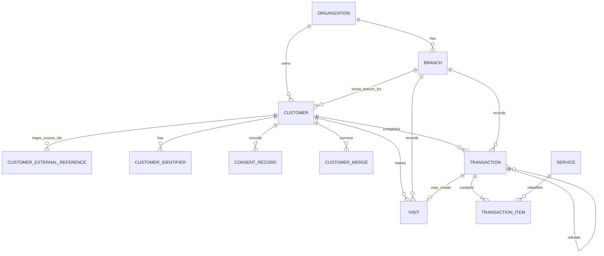
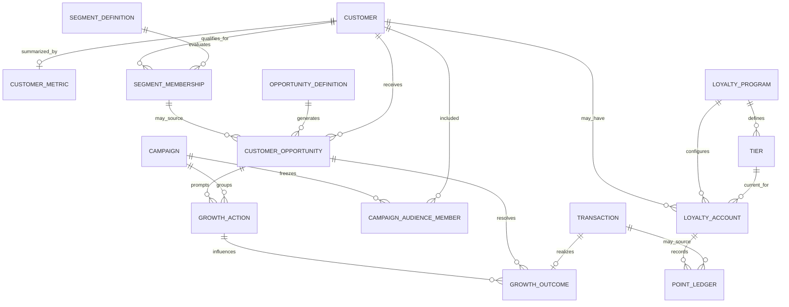
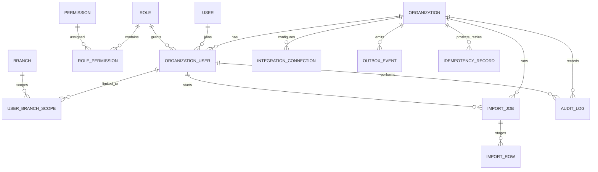

# Custara V1 - Final ERD

Status: Implemented in `apps/api/prisma/schema.prisma`
Database: PostgreSQL
ORM: Prisma 7

## Domain boundaries

| Domain | Source of truth | Main responsibility |
|---|---|---|
| Platform | Organization, Branch, User, Role | Tenant and branch authorization |
| Customer | Customer, ExternalReference, Identifier, Consent | Organization-wide customer identity |
| Revenue | Visit, Transaction, TransactionItem, Service | Immutable business activity |
| Loyalty | LoyaltyAccount, PointLedger, Tier | Optional ledger-based loyalty |
| Growth | Metric, Segment, Opportunity, Action, Outcome | Explainable growth loop |
| Import | ImportJob, ImportRow | Staging, validation, conflict resolution |
| Trust | OutboxEvent, AuditLog, IntegrationConnection | Reliable side effects and operational evidence |

## Identity and revenue

Key decisions:

- Customer is organization-scoped. It does not belong exclusively to one branch.
- Phone and email are indexed duplicate signals, not unconditional unique keys.
- One external source ID maps to one customer through `CustomerExternalReference`.
- Identifier tokens are globally unique and revocable.
- Transaction idempotency uses `(organization_id, source_system, external_transaction_id)`.
- Refund is a new transaction linked to the original sale.
- Historical transaction-item service names and categories are snapshots.

## Growth and loyalty

Key decisions:

- Opportunity is stored per customer. Summary cards are query/cache results.
- A partial unique index allows only one active opportunity per customer and definition.
- `GrowthAction` is first-class; Campaign is an optional batch container.
- `GrowthOutcome` classifies a return as organic or after an eligible action.
- One transaction can be the primary outcome for at most one opportunity.
- Near Tier evaluates only when an active loyalty program exists.
- PointLedger is append-only. Cached balance is never the source of truth.

## Platform, import, and trust

Key decisions:

- Organization context comes from authenticated server context, never trusted directly from request payloads.
- `USER.auth_subject` maps the Supabase Auth JWT `sub` to a Custara user; an active organization membership is still required.
- Branch access is checked through role permission plus branch scope.
- Import rows remain staged until validation and duplicate decisions are complete.
- Outbox events are inserted in the same database transaction as core changes.
- Idempotency records are scoped by organization, method, route, and key so safe retries return the original response.
- Audit, consent, customer merge, and point ledger histories are append-only at database level.

## Critical constraints

| Constraint | Enforcement |
|---|---|
| One customer source ID per organization/source | Database unique index |
| One transaction source ID per organization/source | Database unique index |
| One active segment membership | PostgreSQL partial unique index |
| One active customer opportunity per definition | PostgreSQL partial unique index |
| One outcome per transaction | Database unique index |
| Customer cannot merge into itself | Database check constraint |
| Refund must reference another transaction | Database check constraint + service validation |
| End time cannot precede start time | Database check constraint |
| Ledger/consent/merge/audit mutation blocked | PostgreSQL trigger |
| Retry does not duplicate a completed write | Durable idempotency record |
| Tenant and branch access | API authorization; RLS planned as defense-in-depth |

## Transaction boundaries

The following operations must be atomic:

1. Transaction + items + derived visit + point ledger + outbox event.
2. Customer merge + external references + identifiers + audit log.
3. Import commit batch + row statuses + import counters + outbox events.
4. Opportunity action + opportunity status + audit/outbox event.
5. Return transaction + outcome + opportunity resolution.

Outbound WhatsApp, email, analytics, and automation calls must happen after commit through the outbox worker.
